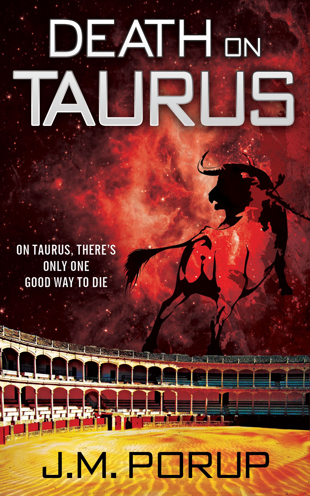

death-on-taurus
===============

Welcome to my series of GitHub novels.

As a ex-hacker turned novelist, I license all my work Creative Commons. So why not release my work on GitHub?

If you like the book, hit me up with some Bitcoin: FIXME

And if you're broke? Tell a friend. Or even better, leave a review. :)

See HOWTO for conversion instructions.

book details
============

Title: *Death on Taurus*

Genre: Science Fiction

Word Count: 75,000

Book Description:

**On Taurus, there's only one good way to die.**

On the bullfighting planet of Taurus, in the far distant future, a genetically engineered race of half-man, half-bull stages ritual blood sacrifices to the gods—human viewers light-years away. Vizzer, the high priest who presides over the daily slaughter, loathes the fights and wants to end them.

When news arrives that the humans have destroyed themselves in an interstellar civil war, he deposes the king and outlaws the fights. But not all the humans are dead. Carlos the Creator lies in stasis on Taurus itself. Vizzer comes face to face with an enraged and ancient god. And in so doing, he must also confront the truth of his own savage nature.
